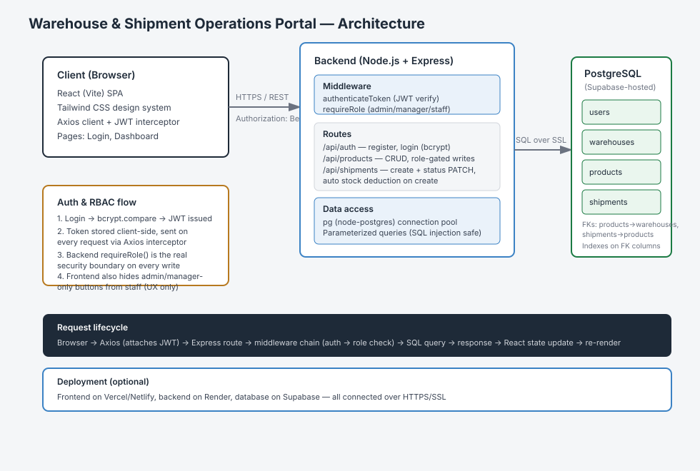
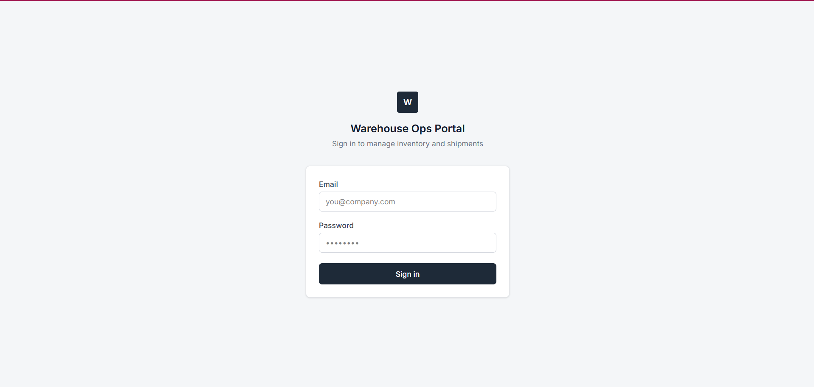
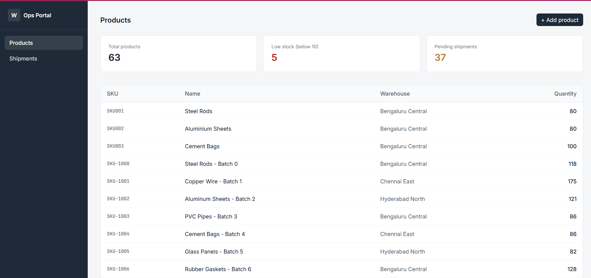
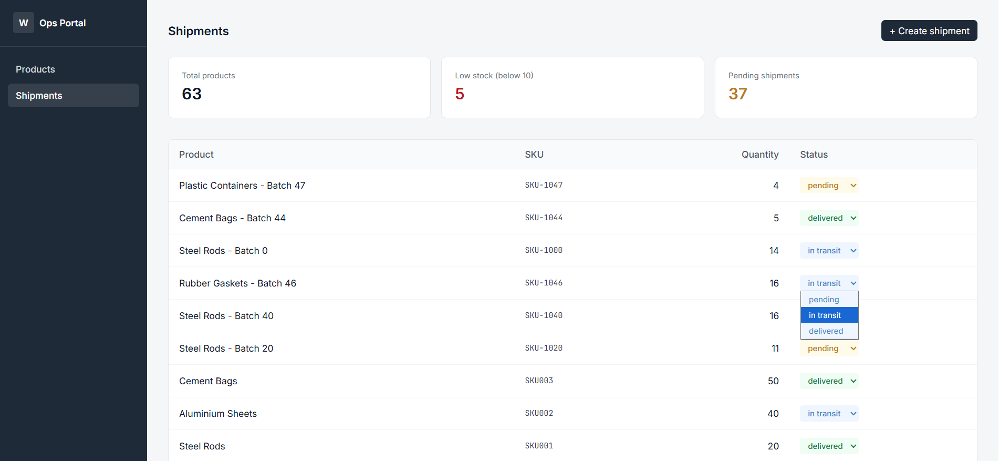
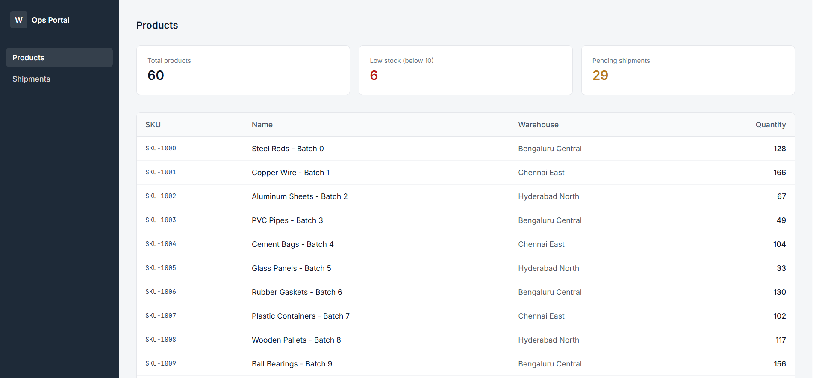
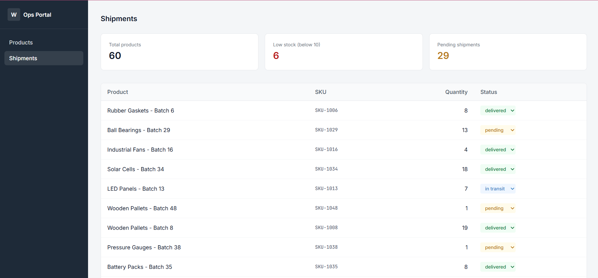

# Warehouse & Shipment Operations Portal

A full-stack web application for tracking inventory and shipment status across multiple warehouses, with role-based access control for admins, managers, and staff.

## Problem it solves
Manual, spreadsheet-based inventory tracking is error-prone and gives no real-time visibility into stock levels or shipment status across warehouses. This portal centralizes that into a single, role-aware system.

## Features
- JWT-based authentication with bcrypt password hashing
- Role-based access control (admin / manager / staff) enforced on both backend and frontend
- Product inventory management with per-warehouse stock tracking
- Shipment creation with automatic stock deduction
- Shipment status workflow (pending → in transit → delivered)
- Dashboard with live stock/shipment summary stats

## Tech stack
- **Backend:** Node.js, Express, PostgreSQL, JWT, bcrypt
- **Frontend:** React (Vite), Tailwind CSS, Axios
- **Database:** PostgreSQL (hosted on Supabase)

## Architecture

## Setup
1. Clone the repo
2. `cd backend && npm install`
3. Create `backend/.env` with `DATABASE_URL`, `JWT_SECRET`, `PORT`
4. Run the SQL schema (see `backend/schema.sql`)
5. `npm run dev` (backend), then `cd frontend && npm install && npm run dev`

## Screenshots

**Login**

**Admin Dashboard (Full Access) — Products**

**Admin Dashboard (Full Access) — Shipments**

**Staff Dashboard (Restricted Access) — Products**

**Staff Dashboard (Restricted Access) — Shipments**
